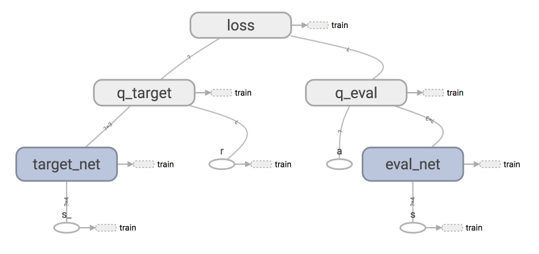

# Reinforcement Learning (RL)
A study env of reinforcement learning, including any implementation of RL algorithm and papers

# Different types of RL algorithms
## Model
1. Model-free RL: Do not try to understand the env;
2. Model-based RL:
    * Try to understand (model) the env;
    * Create a env (environment) simulator, to simulate all possible actions;

## Actions
1. Policy-based: 
    * Policy Gradients;
2. Value-based:
    * Q learning;
    * Sarsa;
3. Actor-Critic:
    * Combined the benefits of policy-based and value-based;
    * Accelerate learning speed of Policy Gradient;

## Update
1. Round:
    * Monte-carlo learning;
    * Basic policy gradients
2. Step:
    * Q leaning;
    * Sarsa;
    * Upgraded policy gradients;
It should be noted that, some of the RL probelm does not belong to any round game.

## Learning policy
1. Online learning:
    * Sarsa/Sarsa lambda;
2. Off-line learning:
    * Q learning;
    * Deep-Q-Network;

# Reinforcement Learning Algorithms
## Q Learning
* The *Q* stands for Quality, which refers to the value every actions taken to measure their significance of reaching the target;
* Persudo code of q-learning
- Initialize *Q(s, a)* arbitrarily  
- Repeat (for each episode):  
    - Initialize *s*  
    - Repeat (for each step of episode):  
        - Choose *a* form *s* using policy derived from Q (e.g., \epsilon-greedy)  
        - Take action *a*, obeserve *r, s'*  
        - *Q(s, a) <- Q(s, a) + \alpha\[r+\gamma max_a' Q(s', a') - Q(s, a)\]*  
        - *s <- s';*  
    - until *s* in terminal;   

* Using learning rate * (real q-value - predicted q-value) to update history actions;  
* The update policy has the common with NN BP;

## Sarsa
* Persudo code of Sarsa,   
- Initialize *Q(s, a)* arbitrarily  
- Repeat (for each episode):  
    - Initialize *s*  
    - Repeat (for each step of episode):  
        - Choose *a* form *s* using policy derived from Q (e.g., \epsilon-greedy)  
        - Take action *a*, obeserve *r, s'*  
        - Choose *a'* form *s'* using policy derived from Q (e.g., \epsilon-greedy)  
        - *Q(s, a) <- Q(s, a) + \alpha [r + \gamma Q(s', a') - Q(s, a)]*
    - until *s* in terminal;   

* Sarsa takes the real action, which makes Sarsa tends to choose a more conservetive way of actions;
* While Q-learning **ALWAYS** choose the shortest way;

## Sarsa (lambda)
* Using flags, to mark states has been choosed;
* Using trace decay coefficient: lambda to model the importance of the past actions;
    * The closer the actions to target, the more important they are;
    * using *lambda_*

* The *E(s, a)* here stands for the eligibility trace;

## DQN: Deep Q Network
* There are 2 types of Q-network:
1. Take current State and Action as input, generates the Q-value of the action;
    * s2 + a1 -> Q(a1);
2. Take current state as input, generates all the Actions and their Q-values respectively;
    * s2 -> Q(a1), Q(a2)

* Experience replay:
    * Sample the past experience randomly;

* Fixed Q-targets:
    * Q target network: taking input from the past, randomly;
    * Q predict network: taking input from the latest action;

Graph of DQN:

A modified grapu of DQN:

## Different types of DQN
**Q**: What is Double DQN?
1. Solving over-estimation problem;

**Q**: What is Prioritised Replay?
1. A little like the attention mechanism, pay more attention to the fewer, positive examples;
2. Increase the learning speed;
3. *TD-error*: Q_target - Q_eval, the larger *TD-error* is, the more potential loss the exampleholds, which indicates a higher priority to be learned;

**Q**: What is Dueling DQN?

## Policy Gradients
* The transition stores only the memory of this episode, NOT all the memory of actions like DQN;

# Notes
Take notes from the reproduction
1. tf.GraphKeys.GLOBAL_VARIBALES:
  * Standard names to use for graph collections;
  * all TRAIN_VARIABLES will be in MODEL_VARIABLES, and all MODEL_VARIABLES will be in GLOBAL_VALIABELS;
2. tf.stop_gardient:
  * When executed in a graph, the op outputs its input tensor as-is;
3. tf.gather_nd:
  * 

# Acoknowledgement

